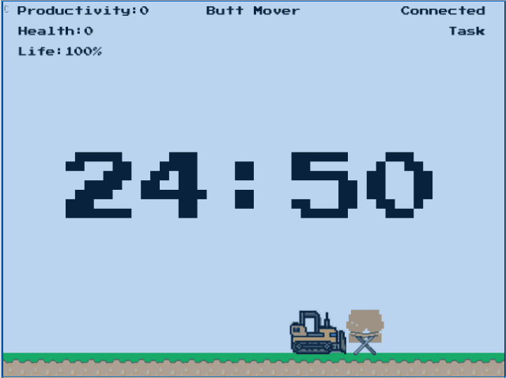
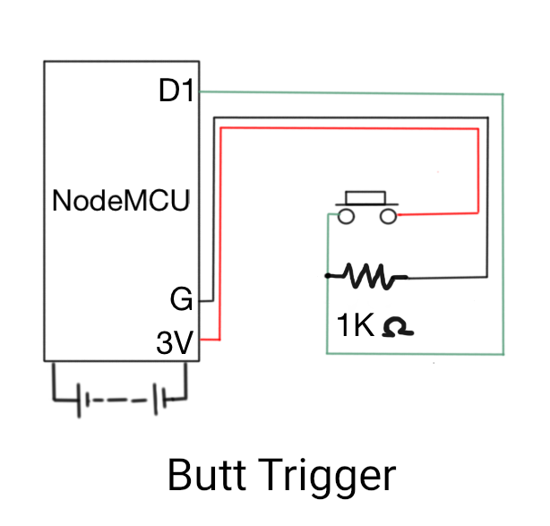

### Butt Mover
A butt triggered productivity and health improvement game.



#### Why
Productivity timers needed to be triggered manually before each task, Making it a chore by itself, Often leading to us not using them after a while and They don't take health into consideration.

Health timers are intrusive, Even then they are not always accurate and They don't take productivity into consideration.

#### How


Butt Mover addresses those problems by using a Butt trigger for automatically starting the productivity timer and a break timer which reminds us to take a walk automatically when we get up.

Butt Mover also incentivizes its usage through a Game. When the health(tasks/breaks) reaches zero its game over.

[](https://www.youtube.com/watch?v=N11jKdnn1Y4)

Click the above image for a video demo.

#### Features
* Cross-platform web application.
* Butt Trigger is a simple button-switch circuit.
* User needs to just plug-in the Butt Trigger to the computer.
* Firmware can be flashed directly from the application.
* Automatic Productivity Timer.
* Automatic Health Timer.
* Game to help incentivize the habit of improving productivity and health.

#### Technical How
1. A ESP8266 switch-button circuit acts as a trigger.
2. The Micropython firmware sends out the button value via UART.
3. Chrome gets the value using web serial.
4. A web worker runs the task/break timers according to the button values.
5. The Web Assemby game is synchronized with the timers.

#### Requirements
1. LoLin NodeMCU Lua V3.
2. 170-Point Breadboard.
3. Momentary Button Switch with Cap.
4. 1 kΩ resister.
5. 22AWG solid core wire.
6. micro-USB power+data cable.

Images for these components are available at [Butt Mover website](https://buttmover.com/#butttrigger)

#### Hardware Setup
**Circuit Diagram**



*Note: Power source is not needed as NodeMCU should be connected to the computer via USB data cable.*

1. Connect the button, resistor, wires on the breadboard according to the circuit and tape them firmly.
2. Solder the other ends of the wires from the breadboard to the NodeMCU.
3. Loop a tag through the Amazon Basics USB data cable box and tie it to the side arm post of the chair.
4. Place the breadboard in the center of the chair and put the NodeMCU inside the box.
5. Place a cushion on the chair.
6. Connect the NodeMCU to the computer using the USB power+data cable.  
7. Flash the firmware.

#### Run the Butt Mover
Download the files and open a web server in the *buttmoverWebApp* folder.

```
$ python3 -m http.server
```

Access Butt Mover at **localhost:8000**.

#### Flash Firmware
1. Click the CONNECT button.
2. Select the Butt Trigger [e.g. USB2.0-Serial (ttyUSB0)] from the pop-up.
3. Select INSTALL BUTT TRIGGER.
4. Select 'Erase device' and click NEXT.
5. Select INSTALL and wait for the installation to complete.
6. Click Next and close the dialog.
7. Click the game, Press C and follow the instructions.

*Note:Butt Trigger requires chrome (or) chromium based browsers with web serial to function.*

#### Build the game
```
$ GOOS=js GOARCH=wasm go build -o main.wasm
```

You can optimize the .wasm file size using [wasm-opt](https://rustwasm.github.io/book/reference/code-size.html#use-the-wasm-opt-tool) if necessary.

#### Build the firmware
Place the **main.py** in the [micropython](https://github.com/micropython/micropython) modules and build the firmware using docker.

```
$ cp buttmoverWebApp/firmware/main.py micropython/ports/esp8266/modules/main.py

$ cd src/github.com/micropython/micropython

$ git submodule update --init

$ cd ports/esp8266

$ docker run --rm -v $HOME:$HOME -u $UID -w $PWD larsks/esp-open-sdk make -j $(nproc)
```
Note:
[esp-web-tools](https://github.com/esphome/esp-web-tools) stopped supporting micropython flashing on NodeMCU since version 6.1.1 as their dependency(esp-web-flasher) removed [header patching](https://github.com/NabuCasa/esp-web-flasher/issues/103).

But right now esp-web-tools seems to have replaced that dependency with esptool-js, So I don't know if the latest version would work with micropython.

#### I don't want to do all these, Just want to use Butt Mover
You can use Butt Mover from https://buttmover.com.

#### Thanks
1. [Ebitenengine](https://github.com/hajimehoshi/ebiten) - A dead simple 2D game library for Go.
2. [Micropython](https://github.com/micropython/micropython) - a lean and efficient Python implementation for microcontrollers and constrained systems.
3. [esp-web-tools](https://github.com/esphome/esp-web-tools) - Open source tools to allow working with ESP devices in the browser.

#### Contributions & support
Contributions to improve the project and monetary support if you find the project useful are welcomed.

### Simple Butt Mover
For those just want a simple butt triggered timer without the complexity of the game, I have also created a Simple Butt Mover - https://github.com/abishekmuthian/simpleButtMover .